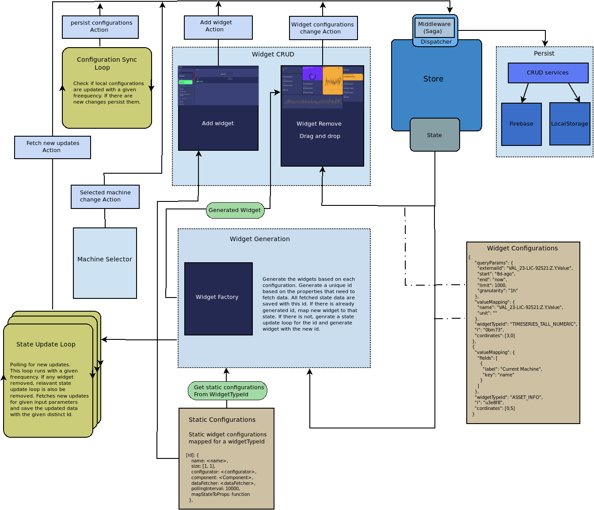

# Cognite Glimpse

This repository is a showcase of how to build dashboard style apps on top of [Cognite Data Fusion](https://cognite.com/cognite/cognite-data-fusion/developers/). It can be used to build configurable dashboards showing various type of information such as events, time series, meta fields, shift utilization, etc which can be used to give a high-level overview about efficiency of a manufacturing process for example.

Information is presented using a set of widgets which the operator can configure. Each widget is laid out in a fixed sized grid. Position of widgets in the grid can be changed based on operator's preferences. Overall dashboard configuration is persisted for each user separately.

## Overview

Application is based on React/Redux. We use Redux-saga for data fetching (asynchronous state management).

[react-grid-layout](https://github.com/STRML/react-grid-layout) is used for maintaining the dragging and dropping widgets in the grid system.

[Material-UI](https://material-ui.com/) is used for styling the widgets and the application.

## Getting started

- Clone the repository
  ```bash
  $ git clone https://github.com/cognitedata/glimpse.git
  ```
- This app use [Firebase Cloud Firestore](https://firebase.google.com/docs/firestore) for saving data. You must [create a firebase project](https://firebase.google.com/docs/firestore/quickstart) and complete .env template inside the root folder with correct values. In the firestore create empty collections

  - alarm-config
  - app-config
  - widget-config

  \
   **Note**
  For developing purposes, you can use local storage in the browser without configuring the firebase. you can edit environment variable `REACT_APP_USE_LOCALSTORAGE` in .env file in the root folder. (Change this to `false` if you are using firebase)

  ```
  REACT_APP_USE_LOCALSTORAGE=true
  ```

* Install dependencies and start the app
  ```bash
  $ yarn && yarn start:https
  ```
  If the browser is not opened automatically please use `https://localhost:3000/`
  After opening the browser if you get an error about a certificate not being valid or trusted, then click "advanced" and "proceed" to skip.

## Unit testing

[react-testing-library](https://testing-library.com/docs/react-testing-library/intro) with [jest](https://jestjs.io/) as the test runner are used for unit testing. It is prefered to write tests that closely resemble how your web pages are used. For more info read [here](https://testing-library.com/docs/guiding-principles).

Run all tests

```bash
$ yarn test
```

## Architecture diagram



## License

[Apache 2.0](https://www.apache.org/licenses/LICENSE-2.0)
